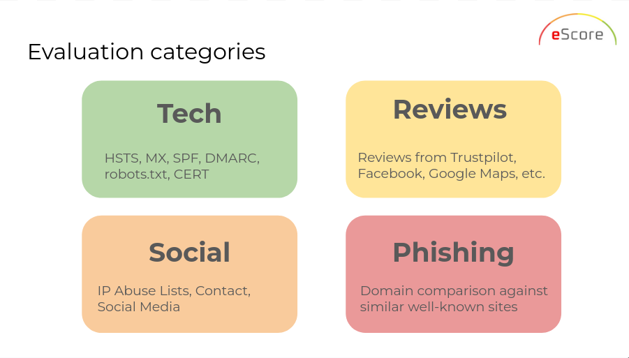
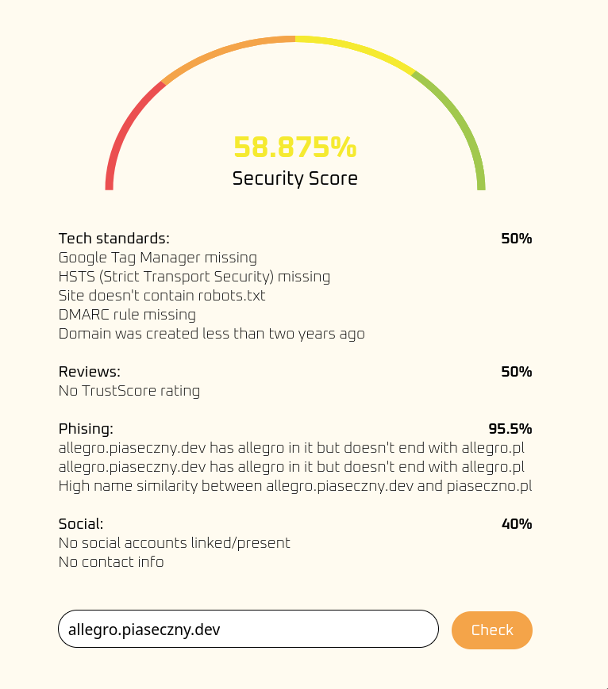
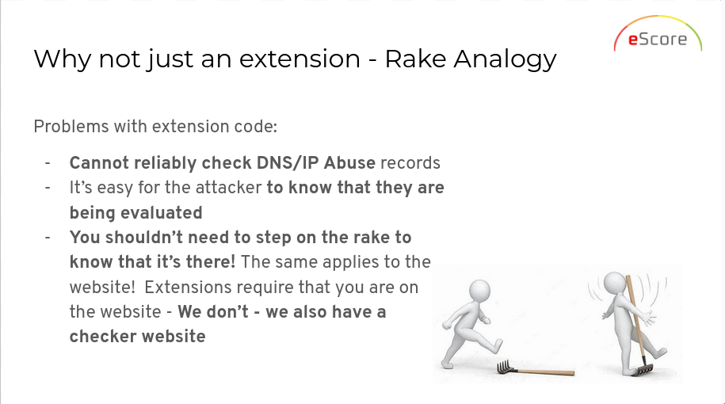

# eScore - easy website authenticity check

In the past you could tell that a shop is fake just by looking at it for one second. Nowadays AI makes it much easier to create good looking fake e-commerce stores in bulk. **eScore** allows you to easily go beyond the optics and judge the page more accurately.

## How do we judge the website? 

We have 4 categories of factors, each one representing a different area of security:

<p align="center">
    
</p>

This *hopefully readable* snippet of code is more exhaustive than I could ever be:

```py
if __name__ == "__main__":
    tech_standards.add_factor(MailFactor(), -10)  # 0 (good) or 1
    tech_standards.add_factor(HSTSFactor(), -10)  # 0 (good) or 1
    tech_standards.add_factor(GTMChecker(DEBUG), -10)  # 0 (good) or 1
    tech_standards.add_factor(WhoisChecker(DEBUG), -10)  # 0 (good) or 1
    tech_standards.add_factor(RobotsDetector(DEBUG), -10)  # 0 (good) or 1

    social.add_factor(CertFactor("cert.csv", "AdresDomeny"), -50)  # 0 (good) or 1
    social.add_factor(
        AbuseIpDatabaseFactor(ABUSE_IP_DB_API_KEY), -0.5
    )  # 0 (good) to 100
    social.add_factor(SocialDetector(DEBUG), -30)  # 0 (good) or 1
    social.add_factor(ContactsChecker(DEBUG), -30)  # 0 (good) or 1

    phishing.add_factor(
        MisleadingSubdomainFactor("pl.csv", "DomainName"), -1.5
    )  # 0 (good) or 1
    phishing.add_factor(
        MisleadingSubdomainFactor("en.csv", "DomainName"), -1.5
    )  # 0 (good) or 1
    phishing.add_factor(
        SuspiciousNameFactor("pl.csv", "DomainName"), -1.5
    )  # 0 (good) or 1
    phishing.add_factor(
        SuspiciousNameFactor("en.csv", "DomainName"), -1.5
    )  # 0 (good) or 1

    reviews.add_factor(TrustpilotFactor(), -1)  # 0 (good) to 50
```

## Running locally

If you have docker (why would you not have it?), run:

```
docker run --rm -p 80:5000 -e ESCORE_DEBUG=True -e ESCORE_API_KEY="your ip abuse db key" typicalam/escore:latest
```

You can then visit `localhost` using the browser or use `curl`:

```
curl --header "Content-Type: application/json" --data '{"url": "https://e-garnitury.pl/"}' http://localhost/check_url
```

Demo available [here](https://sscore.piaseczny.dev/), have fun!

## Images

<p align="center">
    
</p>

<p align="center">
    
</p>
